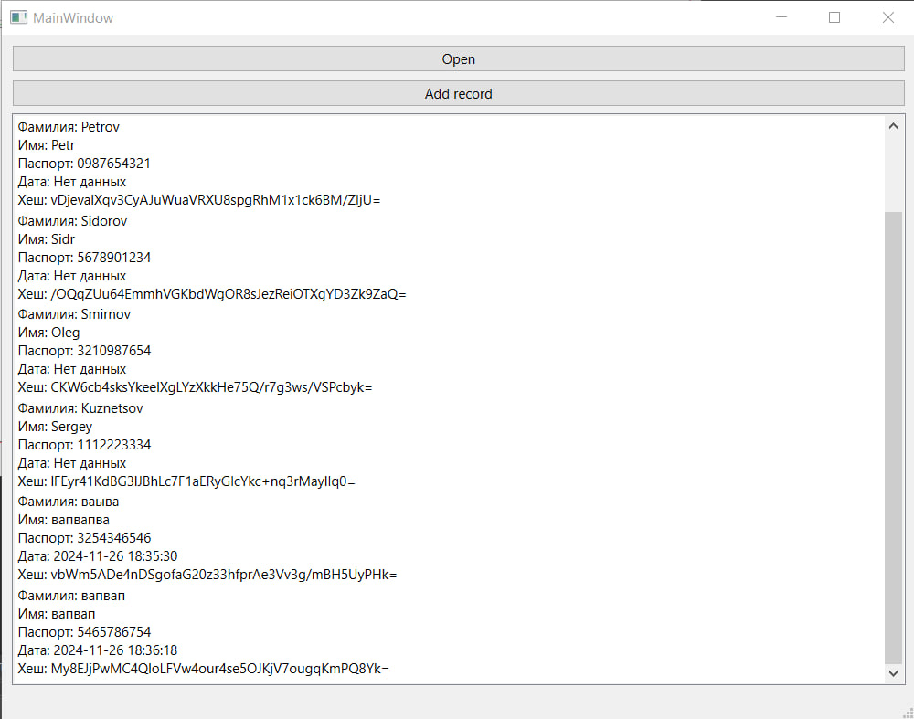
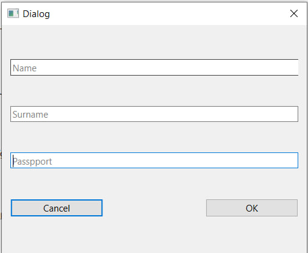

# JSON Record Manager

## Описание
Программа для работы с JSON-файлами: открытие, просмотр, добавление записей с автогенерацией даты, времени и хеша. Нарушения цепочки хешей подсвечиваются красным цветом.

## Возможности
- Открытие JSON-файлов и отображение записей.
- Автогенерация данных при добавлении записи.
- Проверка цепочки хешей и подсветка ошибок.

## Использование
1. **Открытие файла**: Нажмите "Open" и выберите JSON-файл. Записи загрузятся в список.
2. **Добавление записи**: Нажмите "Add", введите данные. Новая запись сохраняется в файл и отображается в списке.

## Интерфейс

### Окно с загруженным JSON

### Диалог добавления записи

